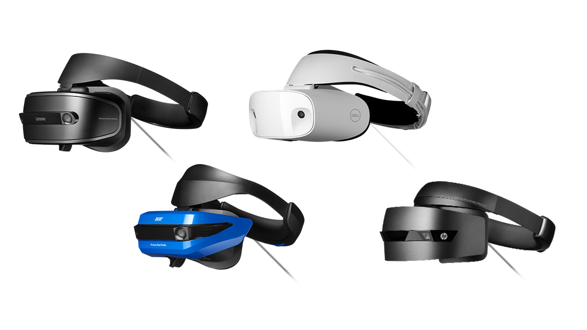

# WebVR Hardware

To view WebVR content on Microsft Edge, you can use a Windows Mixed Reality headset. These headsets connect to the HDMI and USB 3 ports of compatible desktop or laptop computer, and include screens and position sensors.

Several Windows Mixed Reality developer editions are available to purchase. Hand controllers will also be available soon. See [Windows Mixed Reality holiday update](https://blogs.windows.com/windowsexperience/2017/08/28/windows-mixed-reality-holiday-update/) for more information.

* [HP Windows Mixed Reality Headset Developer Edition](https://www.microsoft.com/en-us/store/d/hp-windows-mixed-reality-headset-developer-edition/91thzqtvgspf/lpmq)

* [Acer Windows Mixed Reality Headset Developer Edition](https://www.microsoft.com/en-us/store/d/acer-windows-mixed-reality-headset-developer-edition/8pb4twx13m2n/7zt9)

## HoloLens

The [Microsoft HoloLens](https://developer.microsoft.com/en-us/windows/mixed-reality/hololens_hardware_details) also supports WebVR content.

## Other resources

[MicrosoftStore](https://www.microsoft.com/en-us/store/b/virtualreality?icid=CNavVirtualReality) link to VR hardware, including headsets.

## Alternatives to headsets

If you don't currently have access to a headset, you can use the [Windows Mixed Reality Simulator](https://developer.microsoft.com/en-us/windows/mixed-reality/using_the_windows_mixed_reality_simulator) to open an instance of the Microsoft Edge browser, and go to a site containing WebVR content.

